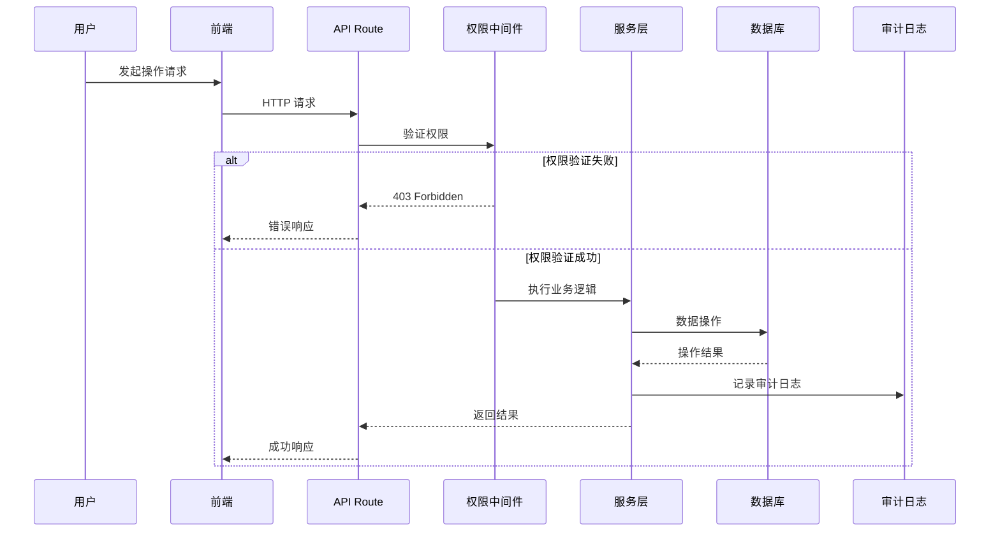
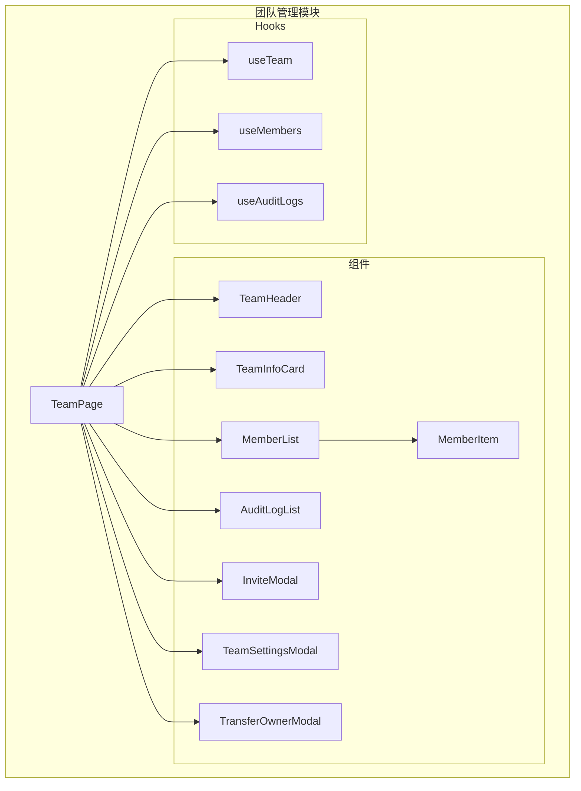
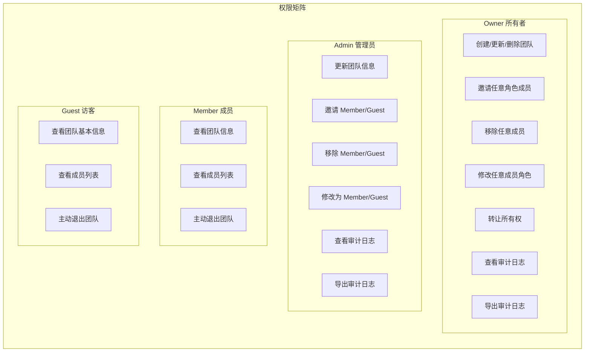

# 团队管理功能设计文档

## 概述

团队管理功能是 Aggregator AI 模型聚合平台的企业级核心模块，提供完整的团队协作能力。该功能允许用户创建团队、管理成员、分配角色权限，并通过审计日志追踪所有敏感操作。

### 设计目标

1. **安全性**：基于角色的访问控制（RBAC），确保权限隔离
2. **可追溯性**：完整的审计日志，满足企业合规需求
3. **易用性**：直观的管理界面，降低使用门槛
4. **可扩展性**：模块化设计，便于后续功能扩展

### 技术栈

- **前端**：Next.js 14 + TypeScript + Redux Toolkit + Tailwind CSS
- **后端**：Next.js API Routes
- **数据库**：Supabase (PostgreSQL)
- **认证**：NextAuth.js（已集成）+ Supabase Auth（可选）

---

## 架构设计

### 系统架构图

```mermaid
graph TB
    subgraph Frontend["前端层"]
        UI[团队管理 UI]
        Redux[Redux Store]
        UI --> Redux
    end
    
    subgraph API["API 层"]
        TeamAPI[/api/teams]
        MemberAPI[/api/teams/:id/members]
        AuditAPI[/api/teams/:id/audit-logs]
    end
    
    subgraph Service["服务层"]
        TeamService[TeamService]
        MemberService[MemberService]
        AuditService[AuditService]
        AuthMiddleware[权限中间件]
    end
    
    subgraph Data["数据层"]
        Teams[(teams)]
        Members[(team_members)]
        AuditLogs[(audit_logs)]
        Users[(users)]
    end
    
    UI --> TeamAPI
    UI --> MemberAPI
    UI --> AuditAPI
    
    TeamAPI --> AuthMiddleware
    MemberAPI --> AuthMiddleware
    AuditAPI --> AuthMiddleware
    
    AuthMiddleware --> TeamService
    AuthMiddleware --> MemberService
    AuthMiddleware --> AuditService
    
    TeamService --> Teams
    MemberService --> Members
    MemberService --> Users
    AuditService --> AuditLogs
```

### 数据流图



---

## 组件与接口设计

### API 接口设计

#### 1. 团队管理接口

| 接口 | 方法 | 描述 | 权限要求 |
|------|------|------|----------|
| `/api/teams` | GET | 获取用户所属团队列表 | 已登录 |
| `/api/teams` | POST | 创建新团队 | 已登录 |
| `/api/teams/[id]` | GET | 获取团队详情 | 团队成员 |
| `/api/teams/[id]` | PUT | 更新团队信息 | Owner/Admin |
| `/api/teams/[id]` | DELETE | 删除团队 | Owner |

#### 2. 成员管理接口

| 接口 | 方法 | 描述 | 权限要求 |
|------|------|------|----------|
| `/api/teams/[id]/members` | GET | 获取成员列表 | 团队成员 |
| `/api/teams/[id]/members` | POST | 邀请新成员 | Owner/Admin |
| `/api/teams/[id]/members/[userId]` | PUT | 更新成员角色 | Owner/Admin |
| `/api/teams/[id]/members/[userId]` | DELETE | 移除成员 | Owner/Admin |
| `/api/teams/[id]/transfer` | POST | 转让所有权 | Owner |

#### 3. 审计日志接口

| 接口 | 方法 | 描述 | 权限要求 |
|------|------|------|----------|
| `/api/teams/[id]/audit-logs` | GET | 查询审计日志 | Owner/Admin |
| `/api/teams/[id]/audit-logs/export` | GET | 导出审计日志 | Owner/Admin |

### 请求/响应格式

#### 创建团队

```typescript
// POST /api/teams
// Request
interface CreateTeamRequest {
  name: string;           // 2-100 字符
  description?: string;   // 可选
  logo?: string;          // 可选，URL 或 Base64
}

// Response
interface CreateTeamResponse {
  success: boolean;
  data?: {
    id: string;
    name: string;
    description: string | null;
    logo: string | null;
    owner_id: string;
    created_at: string;
  };
  error?: string;
}
```

#### 邀请成员

```typescript
// POST /api/teams/[id]/members
// Request
interface InviteMemberRequest {
  email: string;
  role: 'admin' | 'member' | 'guest';
}

// Response
interface InviteMemberResponse {
  success: boolean;
  data?: {
    id: string;
    team_id: string;
    user_id: string;
    role: string;
    status: string;
    joined_at: string;
  };
  error?: string;
}
```

#### 审计日志查询

```typescript
// GET /api/teams/[id]/audit-logs
// Query Parameters
interface AuditLogQuery {
  page?: number;          // 默认 1
  limit?: number;         // 默认 50
  start_date?: string;    // ISO 日期
  end_date?: string;      // ISO 日期
  action?: string;        // 操作类型筛选
  user_id?: string;       // 操作者筛选
}

// Response
interface AuditLogResponse {
  success: boolean;
  data?: {
    logs: AuditLog[];
    total: number;
    page: number;
    limit: number;
  };
  error?: string;
}
```

### 前端组件设计



#### 组件职责

| 组件 | 职责 |
|------|------|
| `TeamPage` | 团队管理主页面，协调子组件 |
| `TeamHeader` | 显示团队名称、Logo，提供操作入口 |
| `TeamInfoCard` | 展示团队基本信息和统计数据 |
| `MemberList` | 成员列表，支持搜索、筛选、分页 |
| `MemberItem` | 单个成员卡片，显示信息和操作按钮 |
| `AuditLogList` | 审计日志列表，支持筛选和导出 |
| `InviteModal` | 邀请成员弹窗 |
| `TeamSettingsModal` | 团队设置弹窗 |
| `TransferOwnerModal` | 所有权转让确认弹窗 |

---

## 数据模型

### 数据库表设计 (Supabase/PostgreSQL)

#### teams 表

```sql
CREATE TABLE teams (
  id UUID PRIMARY KEY DEFAULT gen_random_uuid(),
  name VARCHAR(100) NOT NULL,
  description TEXT,
  logo VARCHAR(500),
  owner_id UUID NOT NULL REFERENCES auth.users(id),
  created_at TIMESTAMPTZ DEFAULT NOW(),
  updated_at TIMESTAMPTZ DEFAULT NOW()
);

-- 索引
CREATE INDEX idx_teams_owner_id ON teams(owner_id);

-- 自动更新 updated_at
CREATE OR REPLACE FUNCTION update_updated_at_column()
RETURNS TRIGGER AS $$
BEGIN
  NEW.updated_at = NOW();
  RETURN NEW;
END;
$$ language 'plpgsql';

CREATE TRIGGER update_teams_updated_at
  BEFORE UPDATE ON teams
  FOR EACH ROW EXECUTE FUNCTION update_updated_at_column();

-- RLS 策略
ALTER TABLE teams ENABLE ROW LEVEL SECURITY;

CREATE POLICY "Users can view teams they belong to" ON teams
  FOR SELECT USING (
    id IN (SELECT team_id FROM team_members WHERE user_id = auth.uid())
  );

CREATE POLICY "Users can create teams" ON teams
  FOR INSERT WITH CHECK (owner_id = auth.uid());

CREATE POLICY "Owners can update their teams" ON teams
  FOR UPDATE USING (owner_id = auth.uid());

CREATE POLICY "Owners can delete their teams" ON teams
  FOR DELETE USING (owner_id = auth.uid());
```

#### team_members 表

```sql
CREATE TABLE team_members (
  id UUID PRIMARY KEY DEFAULT gen_random_uuid(),
  team_id UUID NOT NULL REFERENCES teams(id) ON DELETE CASCADE,
  user_id UUID NOT NULL REFERENCES auth.users(id),
  role VARCHAR(20) NOT NULL DEFAULT 'member' CHECK (role IN ('owner', 'admin', 'member', 'guest')),
  status VARCHAR(20) NOT NULL DEFAULT 'active' CHECK (status IN ('active', 'inactive', 'pending')),
  joined_at TIMESTAMPTZ DEFAULT NOW(),
  updated_at TIMESTAMPTZ DEFAULT NOW(),
  
  UNIQUE(team_id, user_id)
);

-- 索引
CREATE INDEX idx_team_members_team_id ON team_members(team_id);
CREATE INDEX idx_team_members_user_id ON team_members(user_id);

-- 自动更新 updated_at
CREATE TRIGGER update_team_members_updated_at
  BEFORE UPDATE ON team_members
  FOR EACH ROW EXECUTE FUNCTION update_updated_at_column();

-- RLS 策略
ALTER TABLE team_members ENABLE ROW LEVEL SECURITY;

CREATE POLICY "Team members can view their team members" ON team_members
  FOR SELECT USING (
    team_id IN (SELECT team_id FROM team_members WHERE user_id = auth.uid())
  );

CREATE POLICY "Owners and admins can manage members" ON team_members
  FOR ALL USING (
    team_id IN (
      SELECT team_id FROM team_members 
      WHERE user_id = auth.uid() AND role IN ('owner', 'admin')
    )
  );
```

#### audit_logs 表

```sql
CREATE TABLE audit_logs (
  id UUID PRIMARY KEY DEFAULT gen_random_uuid(),
  team_id UUID NOT NULL REFERENCES teams(id) ON DELETE CASCADE,
  user_id UUID NOT NULL REFERENCES auth.users(id),
  action VARCHAR(50) NOT NULL,
  target_type VARCHAR(50),
  target_id UUID,
  old_value JSONB,
  new_value JSONB,
  ip_address INET,
  user_agent TEXT,
  created_at TIMESTAMPTZ DEFAULT NOW()
);

-- 索引
CREATE INDEX idx_audit_logs_team_id ON audit_logs(team_id);
CREATE INDEX idx_audit_logs_user_id ON audit_logs(user_id);
CREATE INDEX idx_audit_logs_action ON audit_logs(action);
CREATE INDEX idx_audit_logs_created_at ON audit_logs(created_at);

-- RLS 策略
ALTER TABLE audit_logs ENABLE ROW LEVEL SECURITY;

CREATE POLICY "Owners and admins can view audit logs" ON audit_logs
  FOR SELECT USING (
    team_id IN (
      SELECT team_id FROM team_members 
      WHERE user_id = auth.uid() AND role IN ('owner', 'admin')
    )
  );

CREATE POLICY "System can insert audit logs" ON audit_logs
  FOR INSERT WITH CHECK (true);
```

### TypeScript 类型定义

```typescript
// src/types/team.ts

// 角色类型
export type TeamRole = 'owner' | 'admin' | 'member' | 'guest';

// 成员状态
export type MemberStatus = 'active' | 'inactive' | 'pending';

// 审计操作类型
export type AuditAction = 
  | 'team.create'
  | 'team.update'
  | 'team.delete'
  | 'member.invite'
  | 'member.remove'
  | 'member.role_change'
  | 'ownership.transfer';

// 团队实体
export interface Team {
  id: string;
  name: string;
  description: string | null;
  logo: string | null;
  owner_id: string;
  created_at: string;
  updated_at: string;
}

// 团队成员实体
export interface TeamMember {
  id: string;
  team_id: string;
  user_id: string;
  role: TeamRole;
  status: MemberStatus;
  joined_at: string;
  updated_at: string;
  // 关联用户信息
  user?: {
    username: string;
    email: string;
  };
}

// 审计日志实体
export interface AuditLog {
  id: string;
  team_id: string;
  user_id: string;
  action: AuditAction;
  target_type: string | null;
  target_id: string | null;
  old_value: string | null;
  new_value: string | null;
  ip_address: string | null;
  user_agent: string | null;
  created_at: string;
  // 关联用户信息
  user?: {
    username: string;
  };
}

// 团队列表项（包含用户角色）
export interface TeamListItem extends Team {
  member_count: number;
  user_role: TeamRole;
}

// 团队详情（包含成员列表）
export interface TeamDetail extends Team {
  members: TeamMember[];
  member_count: number;
}
```

### 角色权限矩阵



| 操作 | Owner | Admin | Member | Guest |
|------|:-----:|:-----:|:------:|:-----:|
| 查看团队信息 | ✅ | ✅ | ✅ | ✅ |
| 查看成员列表 | ✅ | ✅ | ✅ | ✅ |
| 更新团队信息 | ✅ | ✅ | ❌ | ❌ |
| 删除团队 | ✅ | ❌ | ❌ | ❌ |
| 邀请 Admin | ✅ | ❌ | ❌ | ❌ |
| 邀请 Member/Guest | ✅ | ✅ | ❌ | ❌ |
| 移除 Admin | ✅ | ❌ | ❌ | ❌ |
| 移除 Member/Guest | ✅ | ✅ | ❌ | ❌ |
| 修改角色为 Admin | ✅ | ❌ | ❌ | ❌ |
| 修改角色为 Member/Guest | ✅ | ✅ | ❌ | ❌ |
| 转让所有权 | ✅ | ❌ | ❌ | ❌ |
| 查看审计日志 | ✅ | ✅ | ❌ | ❌ |
| 导出审计日志 | ✅ | ✅ | ❌ | ❌ |
| 主动退出团队 | ❌ | ✅ | ✅ | ✅ |


---

## 正确性属性

*正确性属性是系统在所有有效执行中都应保持为真的特征或行为——本质上是关于系统应该做什么的形式化陈述。属性作为人类可读规范和机器可验证正确性保证之间的桥梁。*

### Property 1: 团队创建者自动成为 Owner

*对于任意*有效的团队创建请求，创建成功后，发起创建的用户应该自动成为该团队的 Owner 角色成员。

**验证需求: 1.1**

### Property 2: 团队名称长度验证

*对于任意*字符串作为团队名称，当且仅当其长度在 2 到 100 个字符之间（包含边界）时，该名称才应被接受；否则应返回验证错误。

**验证需求: 1.3, 2.4**

### Property 3: 可选字段处理

*对于任意*团队创建请求，无论是否包含 description 和 logo 字段，只要必填字段（name）有效，创建操作都应该成功。

**验证需求: 1.5**

### Property 4: Owner/Admin 更新权限

*对于任意*团队和任意有效的更新数据，当请求者角色为 Owner 或 Admin 时，更新操作应该成功，且团队信息应反映更新后的值。

**验证需求: 2.1**

### Property 5: Member/Guest 更新拒绝

*对于任意*团队和任意更新请求，当请求者角色为 Member 或 Guest 时，更新操作应该返回 403 权限拒绝错误，且团队信息保持不变。

**验证需求: 2.2**

### Property 6: Owner 独占删除权限

*对于任意*团队，只有 Owner 角色可以成功删除团队；Admin、Member、Guest 角色的删除请求都应返回 403 权限拒绝错误。

**验证需求: 3.1, 3.2**

### Property 7: 删除级联清理

*对于任意*被删除的团队，删除操作完成后，该团队的所有成员关系记录也应该被删除，不存在孤立的 team_members 记录。

**验证需求: 3.1**

### Property 8: 邀请权限分层

*对于任意*邀请请求，Owner 可以邀请任意角色（admin/member/guest）的成员；Admin 只能邀请 member 或 guest 角色的成员，邀请 admin 角色应返回权限错误。

**验证需求: 4.4, 4.5**

### Property 9: 重复邀请拒绝

*对于任意*团队和任意已是该团队成员的用户，再次邀请该用户应返回错误，提示用户已存在于团队中。

**验证需求: 4.3**

### Property 10: 角色修改权限分层

*对于任意*角色修改请求，Owner 可以将成员修改为任意非 Owner 角色；Admin 只能将成员修改为 member 或 guest 角色，修改为 admin 角色应返回权限错误。

**验证需求: 5.1, 5.2**

### Property 11: Owner 角色保护

*对于任意*团队，任何尝试修改 Owner 角色或移除 Owner 的操作都应返回错误，Owner 角色只能通过所有权转让来变更。

**验证需求: 5.3, 6.3**

### Property 12: 单一 Owner 不变量

*对于任意*团队，在任何操作（创建、角色修改、所有权转让、成员移除）之后，该团队应该恰好有且仅有一个 Owner 角色的成员。

**验证需求: 5.5**

### Property 13: 移除权限分层

*对于任意*成员移除请求，Owner 可以移除任意非 Owner 成员；Admin 只能移除 member 或 guest 角色的成员，移除 admin 角色应返回权限错误。

**验证需求: 6.1, 6.2**

### Property 14: 成员自主退出

*对于任意*非 Owner 角色的团队成员，该成员可以主动退出团队；Owner 尝试退出应返回错误（需先转让所有权）。

**验证需求: 6.5**

### Property 15: 所有权转让原子性

*对于任意*成功的所有权转让操作，目标成员应成为新 Owner，原 Owner 应降级为 Admin，且这两个变更应该原子性完成（要么都成功，要么都不变）。

**验证需求: 7.1**

### Property 16: 转让权限验证

*对于任意*所有权转让请求，只有当前 Owner 可以发起转让；非 Owner 角色的转让请求应返回 403 权限拒绝错误。

**验证需求: 7.2**

### Property 17: 团队列表成员过滤

*对于任意*用户的团队列表查询，返回的团队列表应该只包含该用户作为成员的团队，不应包含用户不属于的团队。

**验证需求: 8.1**

### Property 18: 团队列表排序

*对于任意*用户的团队列表查询，返回的团队应该按用户加入时间倒序排列（最近加入的排在前面）。

**验证需求: 8.4**

### Property 19: 非成员访问拒绝

*对于任意*团队详情或成员列表查询，当请求者不是该团队成员时，应返回 403 权限拒绝错误。

**验证需求: 9.2**

### Property 20: 成员角色筛选

*对于任意*成员列表查询带有角色筛选参数，返回的成员列表应该只包含指定角色的成员。

**验证需求: 10.3**

### Property 21: 审计日志自动记录

*对于任意*成功的敏感操作（团队创建/更新/删除、成员邀请/移除/角色变更、所有权转让），系统应自动创建对应的审计日志记录，包含操作者 ID、操作类型、目标、IP 地址、User-Agent 和时间戳。

**验证需求: 1.4, 2.3, 3.3, 4.6, 5.4, 6.4, 7.4, 11.1, 11.2, 11.3, 11.4**

### Property 22: 审计日志访问权限

*对于任意*审计日志查询请求，只有 Owner 或 Admin 角色可以访问；Member 或 Guest 角色的请求应返回 403 权限拒绝错误。

**验证需求: 12.1, 12.2**

### Property 23: 审计日志时间筛选

*对于任意*带有时间范围参数的审计日志查询，返回的日志应该只包含在指定时间范围内创建的记录。

**验证需求: 12.3**

### Property 24: 审计日志排序

*对于任意*审计日志查询，返回的日志应该按创建时间倒序排列（最新的排在前面）。

**验证需求: 12.7**

### Property 25: CSV 导出完整性

*对于任意*审计日志导出请求，生成的 CSV 文件应包含所有日志字段，且每条日志记录对应 CSV 中的一行。

**验证需求: 13.1, 13.4**

### Property 26: 导出权限验证

*对于任意*审计日志导出请求，只有 Owner 或 Admin 角色可以导出；其他角色的请求应返回 403 权限拒绝错误。

**验证需求: 13.2**

### Property 27: 认证验证

*对于任意*团队相关 API 请求，未登录用户应收到 401 未认证错误。

**验证需求: 14.1**

### Property 28: 成员身份验证

*对于任意*需要团队成员身份的 API 请求，非团队成员应收到 403 权限拒绝错误。

**验证需求: 14.2**

---

## 错误处理

### HTTP 状态码规范

| 状态码 | 场景 | 响应格式 |
|--------|------|----------|
| 200 | 请求成功 | `{ success: true, data: {...} }` |
| 201 | 创建成功 | `{ success: true, data: {...} }` |
| 400 | 请求参数错误 | `{ success: false, error: "错误描述" }` |
| 401 | 未认证 | `{ success: false, error: "请先登录" }` |
| 403 | 权限不足 | `{ success: false, error: "权限不足" }` |
| 404 | 资源不存在 | `{ success: false, error: "团队不存在" }` |
| 409 | 资源冲突 | `{ success: false, error: "用户已是团队成员" }` |
| 500 | 服务器错误 | `{ success: false, error: "服务器内部错误" }` |

### 错误处理策略

```typescript
// 统一错误响应格式
interface ApiError {
  success: false;
  error: string;
  code?: string;        // 可选的错误代码
  details?: unknown;    // 可选的详细信息
}

// 错误代码枚举
enum ErrorCode {
  VALIDATION_ERROR = 'VALIDATION_ERROR',
  UNAUTHORIZED = 'UNAUTHORIZED',
  FORBIDDEN = 'FORBIDDEN',
  NOT_FOUND = 'NOT_FOUND',
  CONFLICT = 'CONFLICT',
  INTERNAL_ERROR = 'INTERNAL_ERROR',
}

// 权限错误消息映射
const PermissionErrors: Record<string, string> = {
  'team.update': '只有 Owner 或 Admin 可以更新团队信息',
  'team.delete': '只有 Owner 可以删除团队',
  'member.invite': '只有 Owner 或 Admin 可以邀请成员',
  'member.remove': '只有 Owner 或 Admin 可以移除成员',
  'role.change': '只有 Owner 或 Admin 可以修改成员角色',
  'ownership.transfer': '只有 Owner 可以转让所有权',
  'audit.view': '只有 Owner 或 Admin 可以查看审计日志',
  'audit.export': '只有 Owner 或 Admin 可以导出审计日志',
};
```

### 验证错误处理

```typescript
// 团队名称验证
function validateTeamName(name: string): string | null {
  if (!name || name.trim().length === 0) {
    return '团队名称不能为空';
  }
  if (name.length < 2) {
    return '团队名称至少需要 2 个字符';
  }
  if (name.length > 100) {
    return '团队名称不能超过 100 个字符';
  }
  return null;
}

// 邮箱验证
function validateEmail(email: string): string | null {
  const emailRegex = /^[^\s@]+@[^\s@]+\.[^\s@]+$/;
  if (!email || !emailRegex.test(email)) {
    return '邮箱格式无效';
  }
  return null;
}

// 角色验证
function validateRole(role: string): string | null {
  const validRoles = ['owner', 'admin', 'member', 'guest'];
  if (!validRoles.includes(role)) {
    return '无效的角色类型';
  }
  return null;
}
```

---

## 测试策略

### 测试方法

本功能采用双重测试策略：

1. **单元测试**：验证具体示例、边界情况和错误条件
2. **属性测试**：验证所有输入的通用属性

两种测试方法互补，共同提供全面的测试覆盖。

### 属性测试配置

- **测试库**：使用 `fast-check` 进行属性测试
- **迭代次数**：每个属性测试至少运行 100 次
- **标签格式**：`Feature: team-management, Property {number}: {property_text}`

### 测试分类

#### 单元测试（示例和边界情况）

| 测试类别 | 测试内容 |
|----------|----------|
| 团队创建 | 空名称拒绝、边界长度（2字符、100字符）、特殊字符处理 |
| 邮箱验证 | 无效格式拒绝、边界情况（无@、多@、无域名） |
| 权限边界 | 各角色权限边界测试 |
| 错误响应 | 各种错误场景的响应格式验证 |

#### 属性测试

| 属性编号 | 测试描述 | 生成器 |
|----------|----------|--------|
| Property 1 | 创建者成为 Owner | 随机用户 + 有效团队数据 |
| Property 2 | 名称长度验证 | 任意长度字符串 |
| Property 4-5 | 更新权限验证 | 随机角色 + 随机更新数据 |
| Property 6-7 | 删除权限和级联 | 随机角色 + 随机团队 |
| Property 8 | 邀请权限分层 | 随机角色组合 |
| Property 10-11 | 角色修改权限 | 随机角色变更 |
| Property 12 | 单一 Owner 不变量 | 随机操作序列 |
| Property 17-18 | 列表过滤和排序 | 随机用户 + 多团队 |
| Property 21 | 审计日志记录 | 随机敏感操作 |
| Property 22-24 | 审计日志查询 | 随机筛选条件 |

### 测试数据生成器

```typescript
import fc from 'fast-check';

// 有效团队名称生成器
const validTeamName = fc.string({ minLength: 2, maxLength: 100 })
  .filter(s => s.trim().length >= 2);

// 无效团队名称生成器（用于边界测试）
const invalidTeamName = fc.oneof(
  fc.constant(''),
  fc.constant(' '),
  fc.string({ minLength: 0, maxLength: 1 }),
  fc.string({ minLength: 101, maxLength: 200 })
);

// 角色生成器
const teamRole = fc.constantFrom('owner', 'admin', 'member', 'guest');

// 非 Owner 角色生成器
const nonOwnerRole = fc.constantFrom('admin', 'member', 'guest');

// 有效邮箱生成器
const validEmail = fc.emailAddress();

// 团队成员生成器
const teamMember = fc.record({
  id: fc.uuid(),
  user_id: fc.uuid(),
  role: teamRole,
  status: fc.constantFrom('active', 'inactive', 'pending'),
});

// 审计日志操作类型生成器
const auditAction = fc.constantFrom(
  'team.create', 'team.update', 'team.delete',
  'member.invite', 'member.remove', 'member.role_change',
  'ownership.transfer'
);
```

### 关键属性测试示例

```typescript
// Property 12: 单一 Owner 不变量
// Feature: team-management, Property 12: 单一 Owner 不变量
test('团队始终有且仅有一个 Owner', async () => {
  await fc.assert(
    fc.asyncProperty(
      fc.array(teamOperation, { minLength: 1, maxLength: 10 }),
      async (operations) => {
        const team = await createTestTeam();
        
        for (const op of operations) {
          await executeOperation(team.id, op);
        }
        
        const members = await getTeamMembers(team.id);
        const owners = members.filter(m => m.role === 'owner');
        
        expect(owners.length).toBe(1);
      }
    ),
    { numRuns: 100 }
  );
});

// Property 17: 团队列表成员过滤
// Feature: team-management, Property 17: 团队列表成员过滤
test('团队列表只返回用户所属的团队', async () => {
  await fc.assert(
    fc.asyncProperty(
      fc.array(fc.uuid(), { minLength: 1, maxLength: 5 }),
      async (teamIds) => {
        const user = await createTestUser();
        const memberTeams = teamIds.slice(0, 2);
        
        // 用户只加入部分团队
        for (const teamId of memberTeams) {
          await addMember(teamId, user.id);
        }
        
        const result = await getTeamList(user.id);
        
        // 验证返回的团队都是用户所属的
        for (const team of result.data) {
          expect(memberTeams).toContain(team.id);
        }
        
        // 验证没有返回用户不属于的团队
        const nonMemberTeams = teamIds.filter(id => !memberTeams.includes(id));
        for (const team of result.data) {
          expect(nonMemberTeams).not.toContain(team.id);
        }
      }
    ),
    { numRuns: 100 }
  );
});
```

### 测试覆盖目标

| 类别 | 覆盖目标 |
|------|----------|
| 语句覆盖 | ≥ 80% |
| 分支覆盖 | ≥ 75% |
| 属性测试 | 所有 28 个属性 |
| 边界测试 | 所有验证规则的边界值 |

